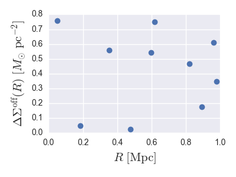

# AstroLabels
A set of common (for me) strings used to label astronomy plots. 

Typing out axes labels like 
```
plt.ylabel('$\Delta\Sigma^\mathrm{off}(R)\ [M_{\odot}\ \mathrm{pc}^{-2}]$')
```
gets old, so I'm starting a repository for keeping track of these strings. 

You can install this (tiny and not-very-functional-at-this-point) package with 
```
$ pip install AstroLabels
```
...but probably you should just fork it and add your own labels, so that its 
useful for whatever kind of plots you make frequently (please send me a pull 
request if you add some useful stuff).

Here's an example using it to label some Python plots:
```python
import numpy as np
import matplotlib.pyplot as plt
import seaborn; seaborn.set()

from astrolabels import AstroLabels
al = AstroLabels()

# hopefully your data doesn't look like this...
plt.plot(np.random.rand(10), np.random.rand(10), 'o')
plt.xlabel(al.r_mpc)
plt.ylabel(al.dsigma_off)
```


Feel free to add your own commonly used labels!
